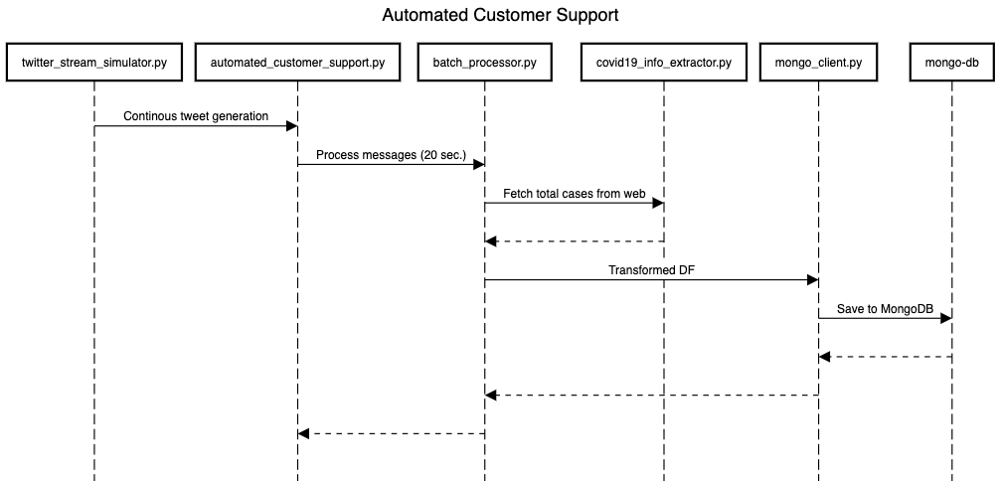

# automated-customer-support
automated-customer-support processes Twitter’s live tweet stream, fetches total coronavirus cases from worldometer.info, merges tweet and coronavirus data, and finally, stores merged data into a MongoDB instance.

## Sequence Diagram

